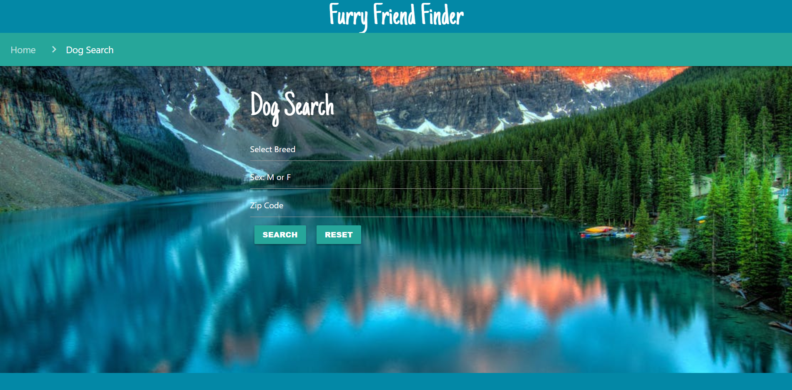
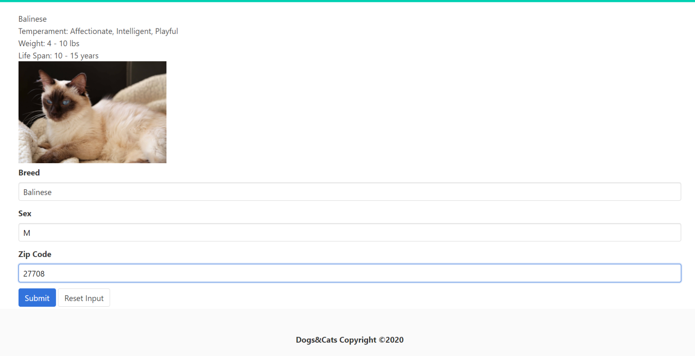
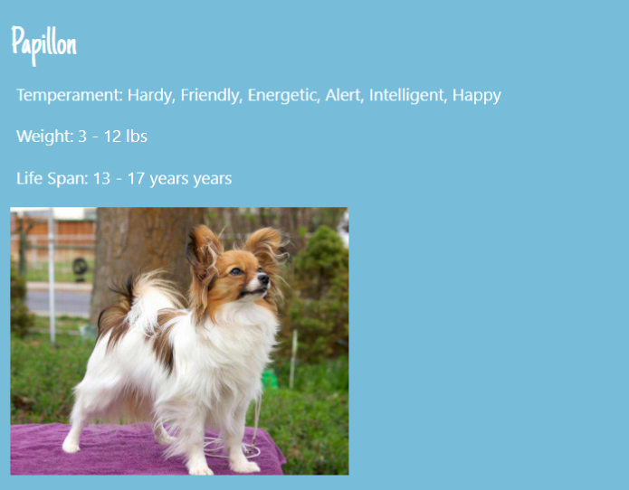
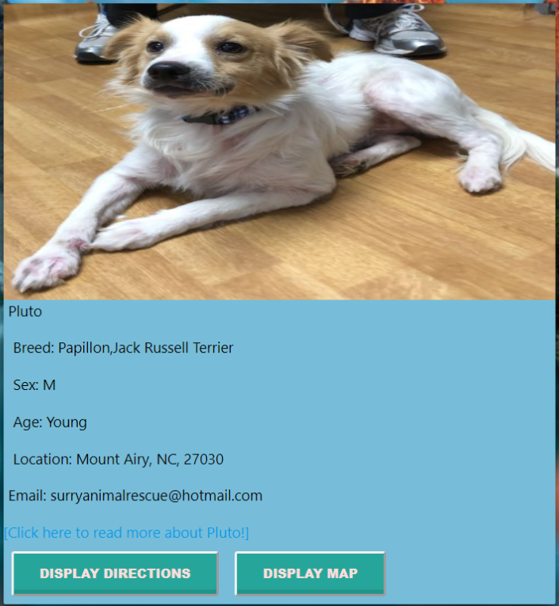
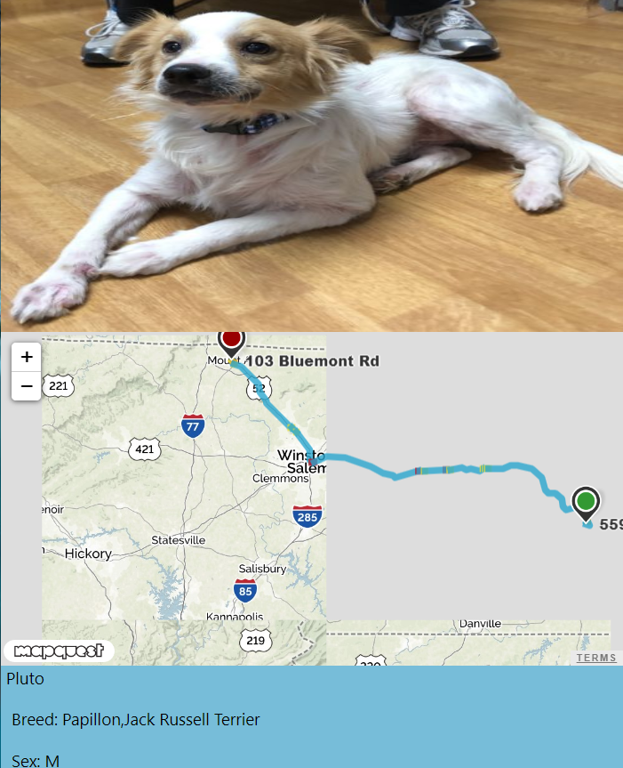
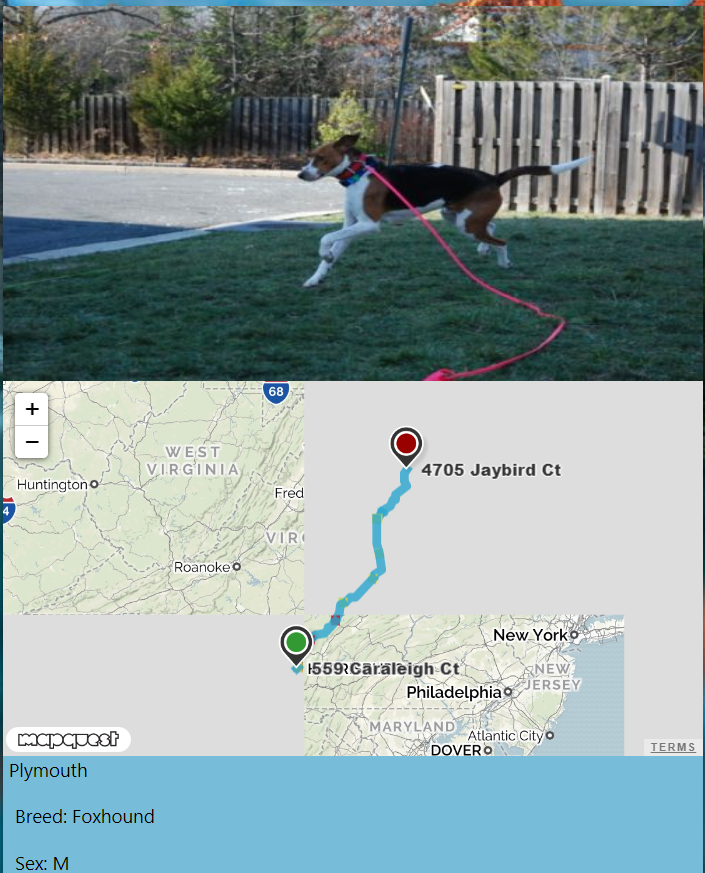

                                         
                                         **Furry Friend Finder**                                    
                                         
**Furry Friend Finder**. Working with team members to create an API app. Our team use petfinder api to load cat and dog information for pet lovers who would like to adopt. Our team members are __Shuyun Mu (Sue), Alex Coulter, Gene Lee, Diantai Johnson.__

Here is the link for our webpage. https://mushuyun.github.io/Project1/

                               
Our app name is called __Furry Friend Finder__. Working with team members to create an API app. Our team use petfinder api to load cat and dog information for pet lovers who would like to adopt. There are input fields for user to enter what kind of cat or dog breed, gender and his or her zip code. When submit, our app will show the breed information, the picture and the contact information for each shelter based on that user's zipcode. For breed information we use the api call from __thecatapi and thedogapi__ to show pictures, size, life span ect. for that specific type at the same time with shelter informaiton. Then our app will call from mapquest api to show the user driving direction and map. In all, we use three type of api calls in this app. 

For the styling and structure, we tried both Bulma and Materialize. 

To summerize: 

Four type of API calls: Petfinder API, The Cat API, The Dog API and the MapQuest API. 

Two frameworks: Bulma and Materialize.

Screenshots to give you an better idea for our app.

